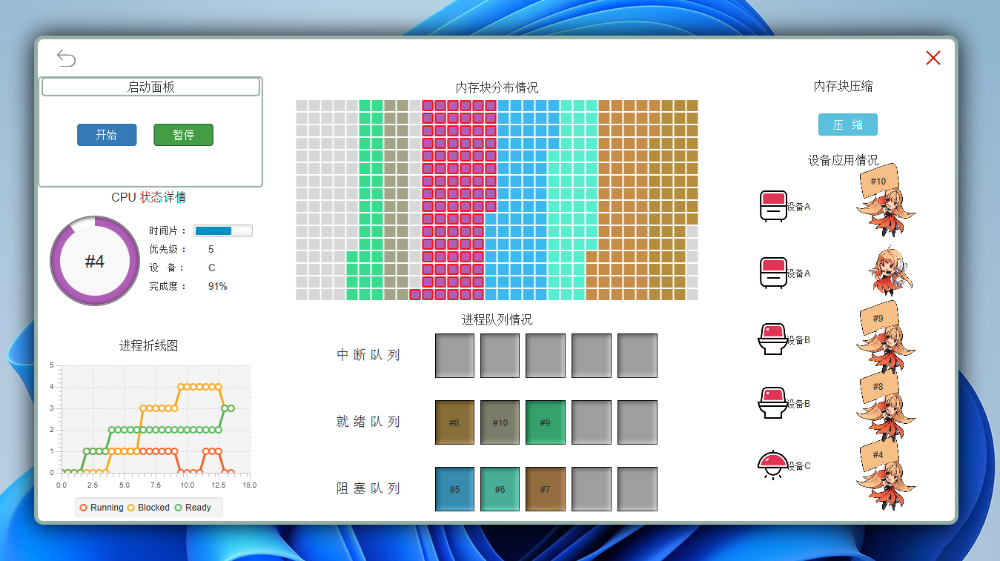

# DPYos 东爷小组的操作系统

### 介绍
##### 1. 系统介绍
具有进程管理，磁盘文件管理的操作系统，用于熟悉操作系统中CPU运行的三种状态，运行、就绪、阻塞。对于文件磁盘管理系统，具有相应的文件读取、写入、删除操作。
##### 2. 运行系统的基础环境
运行环境 ： Java11  JavaFx17

编译环境 ： idea

##### 3. 团队介绍
牛牛勇敢不怕困难
### 软件架构

代码分为5个部分，核心部分其实为3个，5包有CPU模拟、device设备模拟、Listener监听器包、memory内存控制块、ProcessManager管理模块和UI界面可视化设计。

### 1. 多线程CPU和进程创建

CPU作为单独的进程，作为一条时间线，CPU是单线程运行，单核cpu。

同时另一条线程ProcessController负责进程的 **创建**、 **运行**、**销毁**，同时对于进程队列的分配和管理，有阻塞队列、就绪队列、中断队列。

### 2. 多线程界面模块加载

### 运行教程

1.  运行过程请先下载对应的maven jar包
    * junit 用于测试对应模块代码
    * openjfx 界面设计，利用javafx可视化界面开发，同时利用了一点javaweb的知识
    * bootstrapfx javafx 的组件UI优化的css包
3.  xxxx

### 使用说明

1. 界面初始化

   

2. 进程管理界面运行

   

   **这个界面很牛逼啊，主要是窗体的阴影啊，花了我一下午找的资料，一定要看啊**


# 运行的注意事项
## 1. JDK版本

jdk11以上，里面内置了javafx的相关包

如果出现**使用java命令出现Error: A JNI error has occurred, please check your installation and try again的错误**
一般是因为

```java
Exception in thread "main" java.lang.UnsupportedClassVersionError: helloworld has been compiled by a more recent version of the Java Runtime (class file version 54.0), this version of the Java Runtime only recognizes class file versions up to 52.0
```

应该是jdk版本过低，使用jdk11以上


## 2. 界面布局提醒

对于初始界面的web项目，由于全屏设置，需要把缩放与布局设置为100% 

具体操作:[如何调整电脑的缩放和显示布局-百度经验 (baidu.com)](
